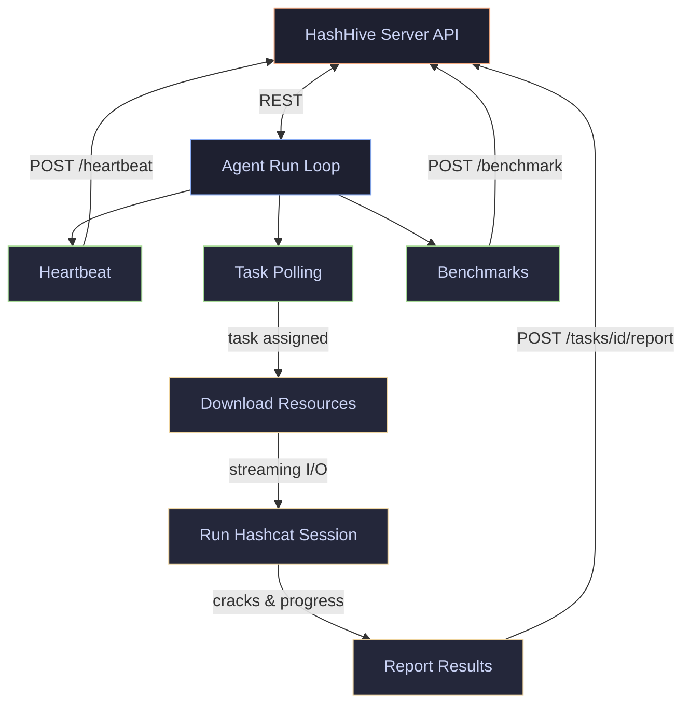

# hash_hive_agent

[![GitHub License][license-badge]][license-link] [![GitHub Sponsors][sponsors-badge]][sponsors-link]

[![GitHub Actions Workflow Status][ci-badge]][ci-link] [![Deps.rs Repository Dependencies][deps-badge]][deps-link]

[![Codecov][codecov-badge]][codecov-link] [![GitHub issues][issues-badge]][issues-link] [![GitHub last commit][last-commit-badge]][commits-link]

[![Crates.io MSRV][msrv-badge]][crates-link]

---

A distributed hashcat agent for the [HashHive](https://github.com/EvilBit-Labs/hash_hive) platform, written in Rust. Connects to a HashHive server, receives hash-cracking tasks, orchestrates hashcat, and reports results -- all with zero `unsafe` code and streaming I/O for 100 GB+ resource files.

Built for air-gapped lab environments with 10+ cracking nodes and dozens of GPUs.

## Project Status

**v0.1.0** -- Initial scaffold. Core architecture is in place; hashcat integration is functional but not yet battle-tested.

- Zero `unsafe` code (`unsafe_code = "forbid"` enforced project-wide)
- Zero warnings with strict pedantic clippy linting
- Cross-platform: Linux, macOS, Windows

## Features

- **Automatic task lifecycle** -- Authenticate, poll for work, download resources, run hashcat, report results
- **Streaming downloads** -- 100 GB+ wordlists and rulelists streamed to disk, never buffered in memory
- **Hashcat output parsing** -- Classifies stdout/stderr lines, handles v6 and v7 format differences, colon-aware parsing for complex hash types
- **Exit code normalization** -- Converts unsigned 8-bit Unix exit codes back to hashcat's signed values
- **Benchmark caching** -- Run once, submit cached results on subsequent startups
- **Graceful shutdown** -- SIGINT/SIGTERM triggers cooperative cancellation; in-flight work is reported before exit
- **Structured logging** -- Human-readable or JSON output via `tracing`
- **Flexible configuration** -- Environment variables (`HASH_HIVE_*`), config file, or CLI flags

## Quick Start

### Prerequisites

- Rust 1.85+ (install via [rustup](https://rustup.rs/))
- [hashcat](https://hashcat.net/hashcat/) installed and on your `PATH`
- A running [HashHive](https://github.com/EvilBit-Labs/hash_hive) server with an agent token

### Installation

#### From source

```bash
git clone https://github.com/EvilBit-Labs/hash_hive_agent.git
cd hash_hive_agent
cargo install --path .
```

#### Pre-built binaries

Download from [releases](https://github.com/EvilBit-Labs/hash_hive_agent/releases) for Linux (amd64, arm64), macOS (Intel, Apple Silicon), and Windows (amd64).

### Usage

```bash
# Minimal -- server URL and token are required
hash-hive-agent --server-url http://server:3001/api/v1/agent --agent-token <token>

# Or set via environment variables
export HASH_HIVE_SERVER_URL=http://server:3001/api/v1/agent
export HASH_HIVE_AGENT_TOKEN=<token>
hash-hive-agent

# With explicit hashcat path and JSON logs
hash-hive-agent --hashcat-path /opt/hashcat/hashcat --json-logs

# Debug logging
hash-hive-agent --log-level debug
```

### Configuration

The agent loads configuration in this order (later sources override earlier ones):

1. Config file (YAML/TOML, via `--config`)
2. Environment variables (`HASH_HIVE_*`)
3. CLI flags

| Setting            | CLI Flag         | Environment Variable           | Default                              |
| ------------------ | ---------------- | ------------------------------ | ------------------------------------ |
| Server URL         | `--server-url`   | `HASH_HIVE_SERVER_URL`         | `http://localhost:3001/api/v1/agent` |
| Agent token        | `--agent-token`  | `HASH_HIVE_AGENT_TOKEN`        | (required)                           |
| Hashcat binary     | `--hashcat-path` | `HASH_HIVE_HASHCAT_PATH`       | `hashcat` (on PATH)                  |
| Log level          | `--log-level`    | `HASH_HIVE_LOG_LEVEL`          | `info`                               |
| JSON logs          | `--json-logs`    | --                             | `false`                              |
| Heartbeat interval | --               | `HASH_HIVE_HEARTBEAT_INTERVAL` | `30s`                                |
| Poll interval      | --               | `HASH_HIVE_POLL_INTERVAL`      | `10s`                                |

## Architecture



| Module       | Purpose                                                               |
| ------------ | --------------------------------------------------------------------- |
| `api/`       | Typed HTTP client for the HashHive Agent API (reqwest + serde)        |
| `agent/`     | Lifecycle orchestration: heartbeat, polling, graceful shutdown        |
| `hashcat/`   | Session management, stdout/stderr parsing, exit code classification   |
| `task/`      | Resource downloads (streaming), hashcat execution, progress reporting |
| `benchmark/` | Benchmark execution and disk caching                                  |
| `config/`    | Configuration from env, file, and CLI with typed defaults             |
| `platform/`  | Cross-platform system metrics (CPU, memory, GPU temperature)          |

## Security

- **Memory safety**: `unsafe_code = "forbid"` enforced at the workspace level
- **No panics in production**: `unwrap_used = "deny"`, `panic = "deny"` via clippy
- **TLS via rustls**: No OpenSSL dependency; `openssl` is banned in `deny.toml`
- **Supply chain**: Daily `cargo audit` and `cargo deny` checks in CI
- **No telemetry**: Zero data collection or external communication beyond the configured server

For security vulnerabilities, see our [security policy](SECURITY.md).

## Roadmap

| Milestone            | Focus                                                                       |
| -------------------- | --------------------------------------------------------------------------- |
| **v0.1.x** (current) | Core scaffold: API client, task lifecycle, hashcat integration              |
| **v0.2.0**           | Zap list support, retry with exponential backoff, benchmark execution       |
| **v0.3.0**           | Restore file management, partial result caching, GPU temperature monitoring |
| **v1.0.0**           | Production-ready: full HashHive API coverage, comprehensive test suite      |

## Development

```bash
# Install dev tools via mise
mise install

# Run tests
just test

# Lint
just lint-rust

# Full CI check (lint + test + build + audit + coverage)
just ci-check

# Generate coverage report
just coverage-report
```

See [CONTRIBUTING.md](CONTRIBUTING.md) for the full development setup and submission process.

## Contributing

Contributions are welcome. See [CONTRIBUTING.md](CONTRIBUTING.md) for development setup, coding guidelines, and the submission process.

## License

Licensed under the Apache License 2.0 -- see [LICENSE](LICENSE) for details.

## Support

- [GitHub Issues](https://github.com/EvilBit-Labs/hash_hive_agent/issues)
- [GitHub Discussions](https://github.com/EvilBit-Labs/hash_hive_agent/discussions)

## Acknowledgments

- [HashHive](https://github.com/EvilBit-Labs/hash_hive) server platform
- [CipherSwarm](https://github.com/unclesp1d3r/CipherSwarm) and [CipherSwarmAgent](https://github.com/unclesp1d3r/CipherSwarmAgent) -- the original Go-based architecture this project succeeds
- [hashcat](https://hashcat.net/hashcat/) -- the engine that does the actual cracking
- The Rust community for excellent tooling and ecosystem

---

Built for security labs and cracking rigs.

<!-- Reference Links -->

[ci-badge]: https://img.shields.io/github/actions/workflow/status/EvilBit-Labs/hash_hive_agent/ci.yml?style=flat-square
[ci-link]: https://github.com/EvilBit-Labs/hash_hive_agent/actions/workflows/ci.yml
[codecov-badge]: https://img.shields.io/codecov/c/github/EvilBit-Labs/hash_hive_agent?style=flat-square&logoColor=white&logo=codecov
[codecov-link]: https://app.codecov.io/gh/EvilBit-Labs/hash_hive_agent
[commits-link]: https://github.com/EvilBit-Labs/hash_hive_agent/commits/main
[crates-link]: https://crates.io/crates/hash_hive_agent
[deps-badge]: https://img.shields.io/deps.rs/repo/github/EvilBit-Labs/hash_hive_agent?style=flat-square
[deps-link]: https://deps.rs/repo/github/EvilBit-Labs/hash_hive_agent
[issues-badge]: https://img.shields.io/github/issues/EvilBit-Labs/hash_hive_agent?style=flat-square&logo=github
[issues-link]: https://github.com/EvilBit-Labs/hash_hive_agent/issues
[last-commit-badge]: https://img.shields.io/github/last-commit/EvilBit-Labs/hash_hive_agent?style=flat-square&logo=github
[license-badge]: https://img.shields.io/github/license/EvilBit-Labs/hash_hive_agent?style=flat-square&logo=github
[license-link]: https://github.com/EvilBit-Labs/hash_hive_agent/blob/main/LICENSE
[msrv-badge]: https://img.shields.io/crates/msrv/hash_hive_agent?style=flat-square&logo=rust
[sponsors-badge]: https://img.shields.io/github/sponsors/EvilBit-Labs?style=flat-square&logo=github
[sponsors-link]: https://github.com/sponsors/EvilBit-Labs
